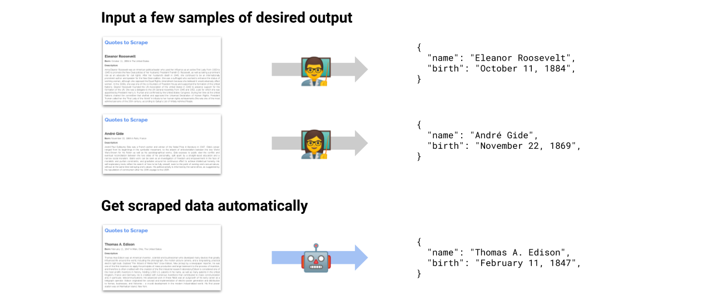

==================================================================================
mlscraper: Scrape data from HTML pages automatically with Machine Learning
==================================================================================

.. image:: https://img.shields.io/travis/lorey/mlscraper   :alt: Travis (.org)
   :target: https://travis-ci.org/github/lorey/mlscraper

.. image:: https://img.shields.io/pypi/v/mlscraper   :alt: PyPI
   :target: https://pypi.org/project/mlscraper/

.. image:: https://img.shields.io/pypi/pyversions/mlscraper   :alt: PyPI - Python Version
   :target: https://pypi.org/project/mlscraper/

`mlscraper` allows you to extract structured data from HTML automatically with Machine Learning.
You train it by providing a few examples of your desired output.
It will then figure out the extraction rules for you automatically
and afterwards you'll be able to extract data from any new page you provide.

----------------
Background Story
----------------

Many services for crawling and scraping automation allow you to select data in a browser and get JSON results in return.
No need to specify CSS selectors or anything else.

I've been wondering for a long time why there's no Open Source solution that does something like this.
So here's my attempt at creating a python library to enable automatic scraping.

All you have to do is define some examples of scraped data.
`mlscraper` will figure out everything else and return clean data.

Currently, this is a proof of concept with a simplistic solution.

------------
How it works
------------

After you've defined the data you want to scrape, mlscraper will:

- find your samples inside the HTML DOM
- determine which rules/methods to apply for extraction
- extract the data for you and return it in a dictionary

.. code:: python

    import requests

    from mlscraper import RuleBasedSingleItemScraper
    from mlscraper.training import SingleItemPageSample

    # the items found on the training page
    targets = {
        "https://test.com/article/1": {"title": "One great result!", "description": "Some description"},
        "https://test.com/article/2": {"title": "Another great result!", "description": "Another description"},
        "https://test.com/article/3": {"title": "Result to be found", "description": "Description to crawl"},
    }

    # fetch html and create samples
    samples = [SingleItemPageSample(requests.get(url).content, targets[url]) for url in targets]

    # training the scraper with the items
    scraper = RuleBasedSingleItemScraper.build(samples)

    # apply the learned rules and extract new item automatically
    result = scraper.scrape(requests.get('https://test.com/article/4'))

    print(result)
    # results in something like:
    # {'title': 'Article four', 'description': 'Scraped automatically'}

You can find working scrapers like a stackoverflow and a quotes scraper in the `examples folder`_.

.. _`examples folder`: examples/

---------------
Getting started
---------------

Install the library via :code:`pip install mlscraper`.
You can then import it via `mlscraper` and use it as shown in the examples.

-----------
Development
-----------

See CONTRIBUTING.rst_

.. _CONTRIBUTING.rst: /CONTRIBUTING.rst

------------
Related work
------------

If you're interested in the underlying research, I can highly recommend these publications:

- Learning to extract hierarchical information from semi-structured documents: http://ftp.cse.buffalo.edu/users/azhang/disc/disc01/cd1/out/papers/cikm/p250.pdf
- WHISK: Extraction of structured and unstructured information: https://www.cis.uni-muenchen.de/~yeong/Kurse/ws0809/WebDataMining/whisk.pdf

I originally called this autoscraper but while working on it someone else released a library named exactly the same.
Check it out here: autoscraper_.

.. _autoscraper: https://github.com/alirezamika/autoscraper
