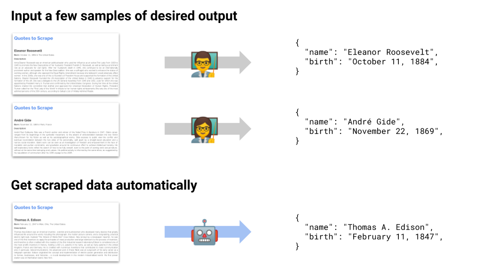

==================================================================================
mlscraper: Scrape data from HTML pages automatically
==================================================================================

.. image:: https://img.shields.io/github/workflow/status/lorey/mlscraper/tests
   :alt: CI status
   :target: https://github.com/lorey/mlscraper/actions

.. image:: https://img.shields.io/pypi/v/mlscraper
   :alt: PyPI version
   :target: https://pypi.org/project/mlscraper/

.. image:: https://img.shields.io/pypi/pyversions/mlscraper
   :alt: PyPI python version
   :target: https://pypi.org/project/mlscraper/

`mlscraper` allows you to extract structured data from HTML automatically
instead of manually specifying nodes or css selectors.
You train it by providing a few examples of your desired output.
It will then figure out the extraction rules for you automatically
and afterwards you'll be able to extract data from any new page you provide.

----------------
Background Story
----------------

Many services for crawling and scraping automation allow you to select data in a browser and get JSON results in return.
No need to specify CSS selectors or anything else.

I've been wondering for a long time why there's no Open Source solution that does something like this.
So here's my attempt at creating a python library to enable automatic scraping.

All you have to do is define some examples of scraped data.
`mlscraper` will figure out everything else and return clean data.

------------
How it works
------------

After you've defined the data you want to scrape, mlscraper will:

- find your samples inside the HTML DOM
- determine which rules/methods to apply for extraction
- extract the data for you and return it in a dictionary

---------------
Getting started
---------------

mlscraper is currently short before version 1.0.
If you want to check the new release, use :code:`pip install --pre mlscraper` to test the release candidate.
You can also install the latest (unstable) development version of mlscraper
via :code:`pip install git+https://github.com/lorey/mlscraper#egg=mlscraper`,
e.g. to check new features or to see if a bug has been fixed already.
Please note that until the 1.0 release :code:`pip install mlscraper` will return an outdated 0.* version.
Check the examples_ directory for usage examples until further documentation arrives.

.. _examples: examples/

-----------
Development
-----------

See CONTRIBUTING.rst_

.. _CONTRIBUTING.rst: /CONTRIBUTING.rst

------------
Related work
------------

I originally called this autoscraper but while working on it someone else released a library named exactly the same.
Check it out here: autoscraper_.
Also, while initially driven by Machine Learning, using statistics to search for heuristics turned out to be faster and requires less training data.
But since the name is memorable, I'll keep it.

.. _autoscraper: https://github.com/alirezamika/autoscraper
